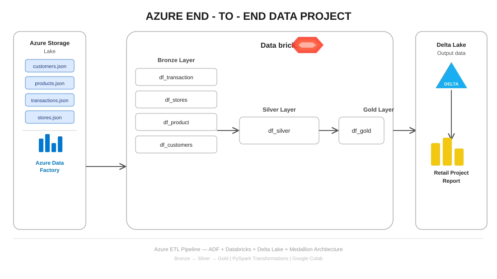

# 🚀 Azure End-to-End ETL Pipeline — ADF + Databricks

---

## 💡 Project Goal

This repository implements a modern, scalable, end-to-end **Data Engineering Pipeline** using core Microsoft Azure services. The goal is to ingest raw data, transform it using Spark, and deliver analytics-ready data layers for BI and ML use cases.

This project focuses on production-style patterns including automated orchestration, **Medallion Architecture**, and scalable **PySpark** transformations.

---

## 🏗️ Architecture Diagram

---

## ⚙️ ADF Pipeline

---

## ☁️ Architectural Overview

The pipeline is built on an **ELT (Extract, Load, Transform)** framework, leveraging the strengths of each Azure service:

| Component | Responsibility | Role |
|---|---|---|
| ⚙️ Azure Data Factory (ADF) | Orchestration & Data Movement | Sequences and schedules workflow, controls data ingestion via Copy Activity |
| 🔥 PySpark (Google Colab) | Scalable Data Transformation | Runs transformation logic across Bronze → Silver → Gold layers |
| 🗄️ Azure Data Lake Storage (ADLS) | Data Lakehouse Storage | Provides scalable storage for all Medallion layers |
| 🔷 Delta Lake | Reliability & ACID Properties | Adds ACID transactions and versioning to the data lake |

> 📌 Note: Due to Azure student subscription limitations, PySpark runs in Google Colab instead of Databricks. ADF handles only the ingestion (raw → bronze), while transformations run in the notebook.

---

## 🥇 Medallion Architecture

| Layer | State | Purpose |
|------|------|--------|
| 🥉 Bronze | Raw Data | Stores raw ingested data (immutable source) |
| 🥈 Silver | Cleaned Data | Data cleansing, deduplication, standardization |
| 🥇 Gold | Business Data | Aggregated data for BI and reporting |

---

🗄️ ADLS Storage Structure
medallion/                        ← ADLS container
├── raw/                          ← Original 4 JSON source files
│   ├── customers.json
│   ├── products.json
│   ├── transactions.json
│   └── stores.json
│
├── bronze/                       ← Raw files copied here by ADF
│   ├── customers.json
│   ├── products.json
│   ├── transactions.json
│   └── stores.json
│
├── silver/                       ← Cleaned Delta tables (PySpark)
│   ├── customers/
│   ├── products/
│   ├── transactions/
│   └── stores/
│
└── gold/                         ← Business report Delta tables
    ├── sales_by_category/
    ├── sales_by_region/
    └── customer_lifetime_value/

    ⚙️ Detailed Pipeline Steps
Step 1 — 📥 Data Ingestion (ADF → Bronze)

Action: ADF Copy Activity extracts all raw JSON files from raw/ folder
Sink: Loads them directly into the bronze/ folder in ADLS
Goal: Establish an immutable record of the raw source data

Step 2 — 🥈 Transformation & Cleansing (Bronze → Silver)
Action: ETL_Notebook.ipynb runs PySpark transformations:

✅ Reads raw data from the Bronze layer
✅ Handles null values (age, email, stock_quantity, rating, discount)
✅ Casts all columns to correct data types (IntegerType, DoubleType, DateType)
✅ Standardizes strings — trims whitespace, uppercases membership & region
✅ Removes duplicate records by primary key
✅ Writes cleaned data to Silver as Delta Lake tables

Step 3 — 🥇 Business Logic & Aggregation (Silver → Gold)
Action: Notebook continues with business aggregation:

✅ Reads all 4 cleaned Silver tables
✅ Joins transactions + products + customers + stores
✅ Calculates revenue: (price × quantity) − discount
✅ Produces 3 Gold report tables (see below)
✅ Writes final data to Gold as Delta Lake tables

Step 4 — 📊 Data Consumption

Result: Gold layer Delta tables are analytics-ready
Downstream tools like Power BI can connect directly to curated tables

📊 Gold Layer Output Tables
1️⃣ Sales by Category
category | total_transactions | total_units_sold | total_revenue | avg_revenue_per_sale
2️⃣ Sales by Region
region | store_name | total_transactions | total_revenue
3️⃣ Customer Lifetime Value
membership | total_orders | total_revenue | avg_order_value

🔧 How to Run
bash# 1. Clone this repository
git clone https://github.com/<your-username>/Azure-ETL-Pipeline-ADF-Databricks.git

# 2. Upload data files to ADLS
#    Go to Azure Portal → learningetl → medallion → raw/
#    Upload all 4 JSON files from data/ folder

# 3. Open notebook in Google Colab
#    Upload notebooks/ETL_Notebook.ipynb to Google Colab

# 4. Update Cell 1 in the notebook
STORAGE_ACCOUNT = "learningetl"
ACCESS_KEY = "<your-access-key>"

# 5. Run all cells — Bronze → Silver → Gold tables written to ADLS

# 6. Trigger ADF pipeline
#    Azure Portal → ADF Studio → PL_ETL_Medallion_Pipeline → Debug
